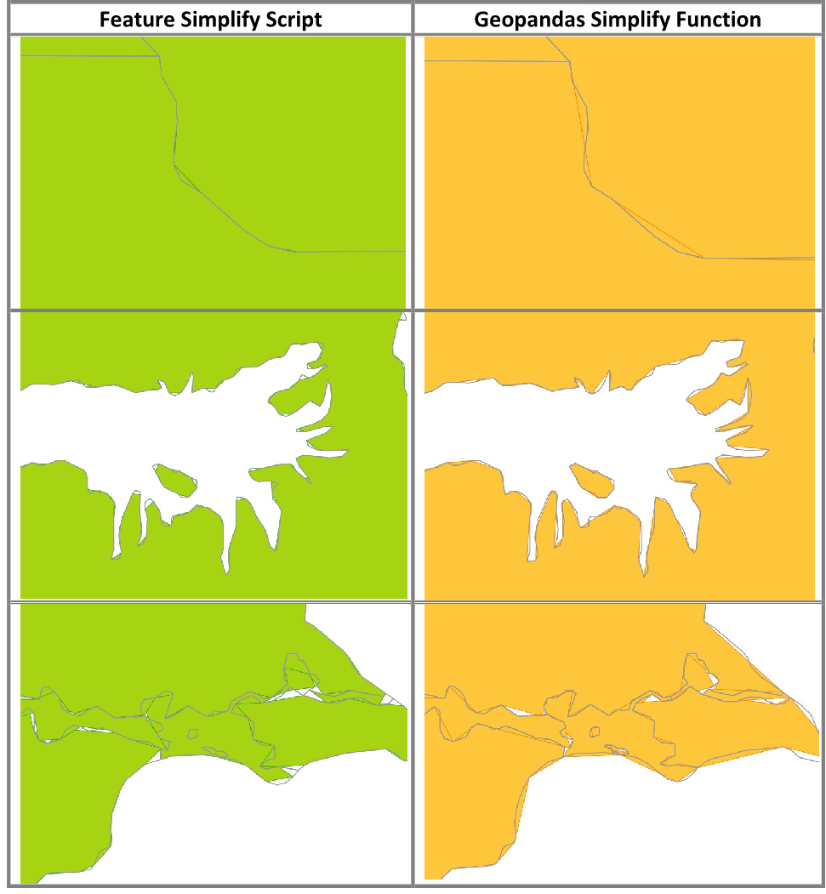
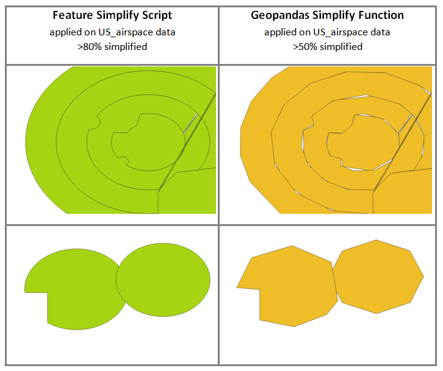

# Simplifying Complex GIS Vector Layers
GIS Vector Layers may contain unnecessary complex features and
geometries. Specially line and polygon features are built from
interconnected coordinates following shape of features. These
representations are not usually optimized in terms of storage and
processing speed.

GIS vector layers can be derived from other types of data in different
software packages. Especially vector layers imported from CAD software
packages create geometrically complex features. This can potentially
create over representation of feature shapes which take too much storage
space and consume high processing time.

## Feature Simplifier Python Script as a Solution

A python script called Feature Simplifier shown in this project examines
the geometries of lines and polygons to simplify them without causing
significant loss of shape and structure.

Two general approaches are implemented. The approaches examine angle
change on vertexes and distance between vertexes.

## Angle Change on Vertexes

A line is represented by interconnected points. Two points form a
straight line. When there is intermediate point/coordinate between two
end points of straight line, the intermediate points can not affect the
shape of the line if there is no angle or orientation change among the
intermediate points. These intermediate points can not affect the shape
of the feature. Features can be simplified by removing the intermediate
points which can not cause orientation change.

In the script, angle/orientation change of each vertex is calculated.
The vertex will be removed if the angle change is below threshold value.
A threshold of 3 degrees can affect some geospatial layers
significantly.

## Distance between Vertexes

This is elimination of one of two consecutive close points/coordinates
when the distance between them is below the set threshold. A circular
feature can be represented by interconnecting millions of pointes. By
eliminating too close pointes the same feature can be represented by few
thousands or hundreds of points. A threshold is set to remove
coordinates closer than a value. With 0.5 (50 %) quintile as a
threshold, significant simplification can be observed on some geospatial
layers.

## Combination of the two Factors

Points can be preserved as long as they cause orientation/angel change
even if they are too close to each other. Different combination of the
two factors mentioned above can be applied to simplify features while
keeping integrity of geometry.

## Setting Threshold 

Deciding on the threshold value requires close examination of feature
geometry, scale and conducting some measurements. To avoid these
cumbersome tasks, quintiles are used. Quantiles from 0 to 1 identify a
value from all lists of distances between points.

## Testing the Feature Simplify Script

A geojson file of 13 mb, Africa_Europe_Asia Country boundaries and 20
mb, US_Airspace data is used to test the script. The following result is
observed tested with the two logical operations of the two parameters.

|  | (angel_difference \< 3) or (distance bn points \< 0.5 quantiles) | (angel_difference \< 3) and (distance bn points \< 0.5 quantiles) |
|----|----|----|
| africa_europe_asia.geojson | 38.3 % simplified | 1.0 % |
| us_airspace.geojson | 70.9 % simplified | 24.7 % simplified |

## Comparison with Geopandas Library

Geopandas is popular python library used for varies analysis on
geospatial data. Geopandas has a function called simplify used to
simplify a GIS data layer. It uses Douglas-Peucker algorithm, it
calculates distance of a point from a theoretical line going through
geometry of a feature. This analysis runs for each point and is resource
intensive. Both Geopandas simplify function and feature simplify script
as explained above are run on a test geospatial data for visual
evaluation of geometry. The parameters are tuned until the output
simplified layers have similar file size for comparison purposes.

The gray line on top of the layers is the original boundaries of
geometries.

The following is comparison using US Airspace data. This data is
originally made using CAD software. It has a lot of circular features
showing different zones of airspaces based on distance from airports.

The feature Smiplify Script has maintained geometries very well with
high simplification. However, geopandas simplify function did not
maintain the circular geometry with smaller simplification rate.

## Observations

The simplify feature script is flexible since it can take two
parameters. The two parameters can be combined in different logical
operations to compare results. Knowing absolute distance to set
tolerance is not necessary; it uses relative distance between pointes
calculated from quantiles. Overall impressive result is observed.

## Way forward

The simplify feature script can be further modified by adjusting the
algorisms to run iteratively for better result. Minimum number of
vertexes in a feature is two. This compromises very small geometric
features. To avoid this problem, minimum number of vertexes can be set
to higher numbers to avoid over simplification on small features.

Prepared By: Yafet Birhanu  
Linkedin: www.linkedin.com/in/yafet-birhanu
